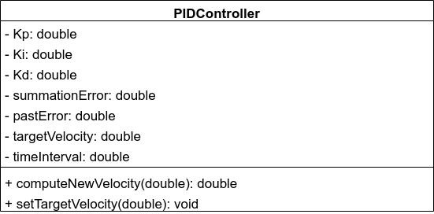
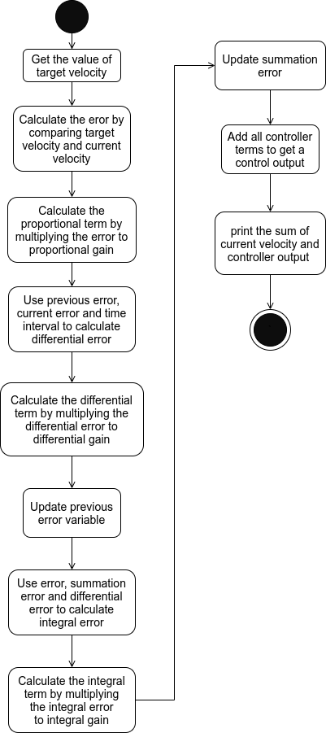

# C++ Boilerplate

---
# Part I

## Driver 
Vivek Sood \
Github Username: viveksood97

## Navigator
Pratik Acharya \
Github Username: pratik-a99 

## UML Diagram
 \
[Link to the PDF](https://drive.google.com/file/d/1mB3QGFGTcNCEAUvfmSz2qRmXcQdjdS70/view?usp=sharing)

## Activity Diagram
 \
[Link to the PDF](https://drive.google.com/file/d/17HL5u0FMskLM-HcG4wG3E4nzX6cem7cY/view?usp=sharing)

